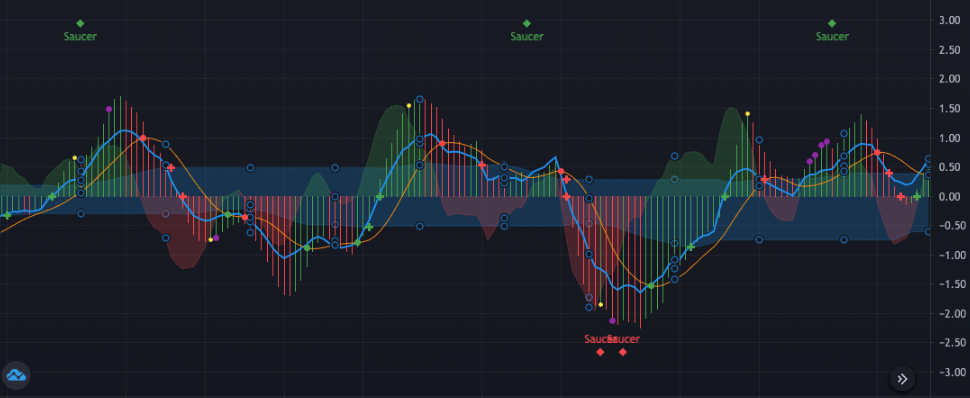
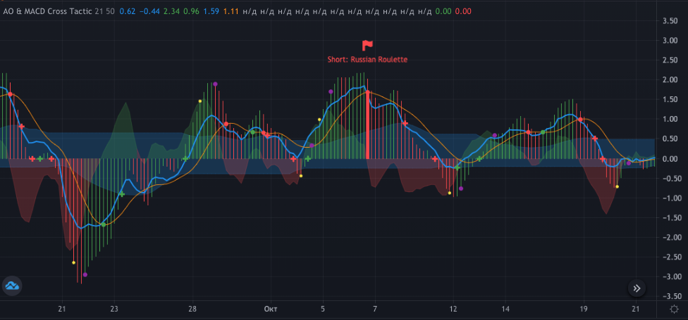
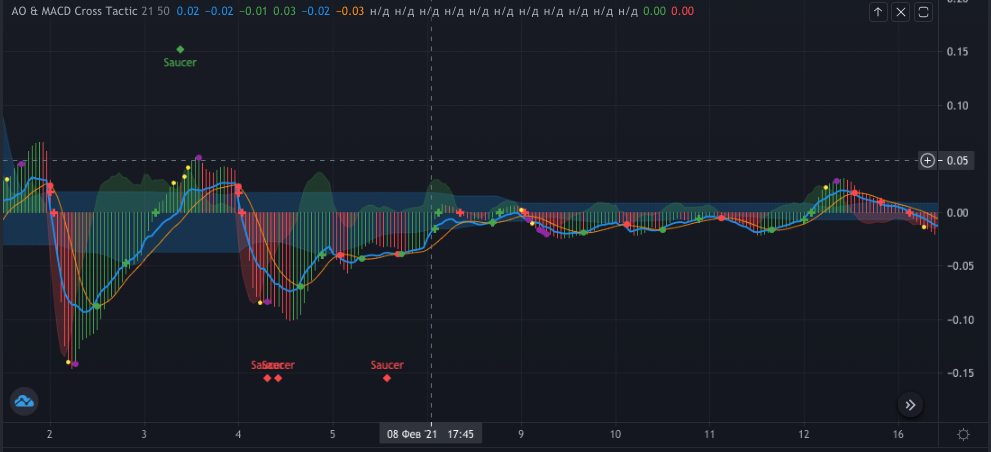
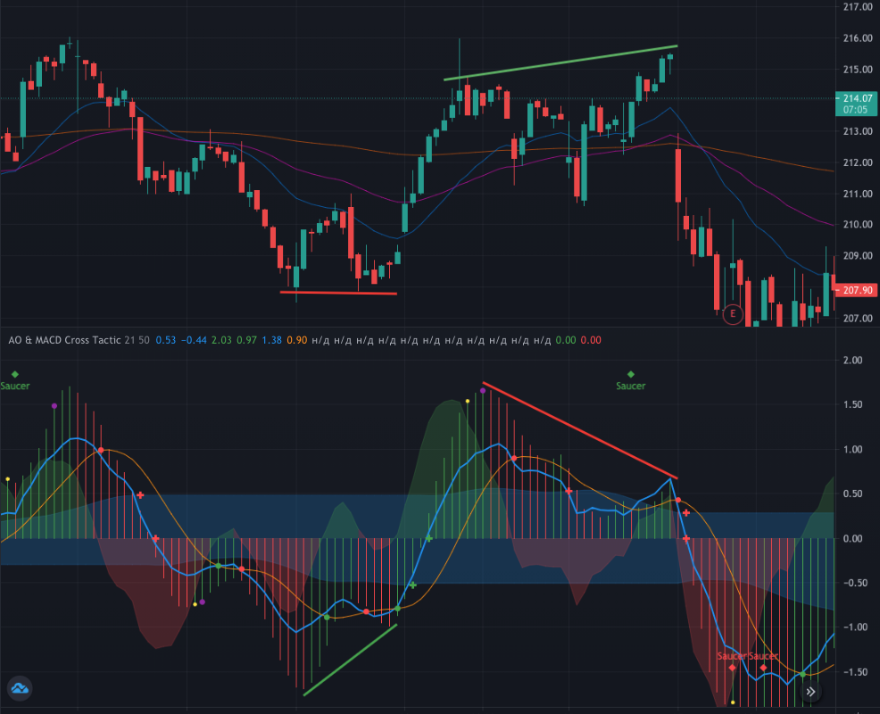
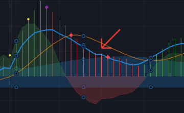
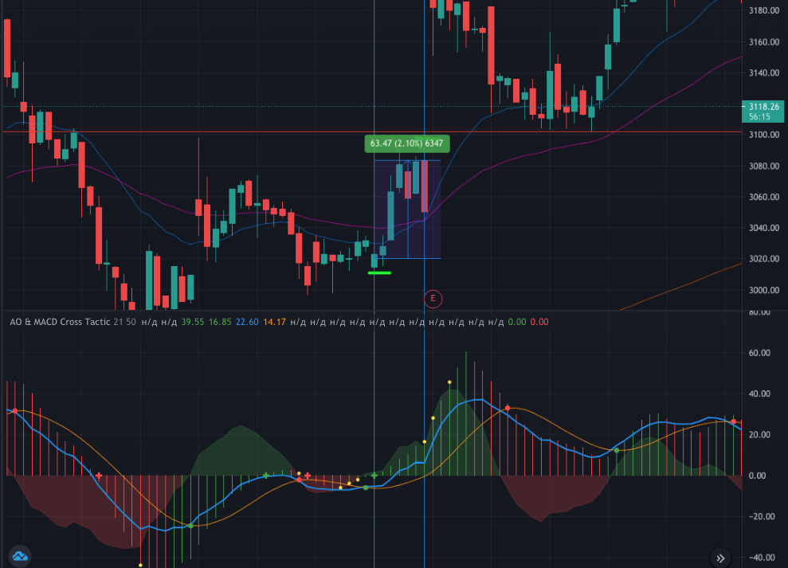
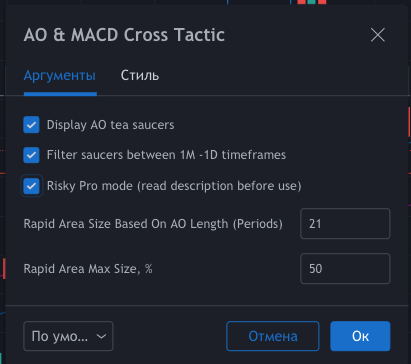
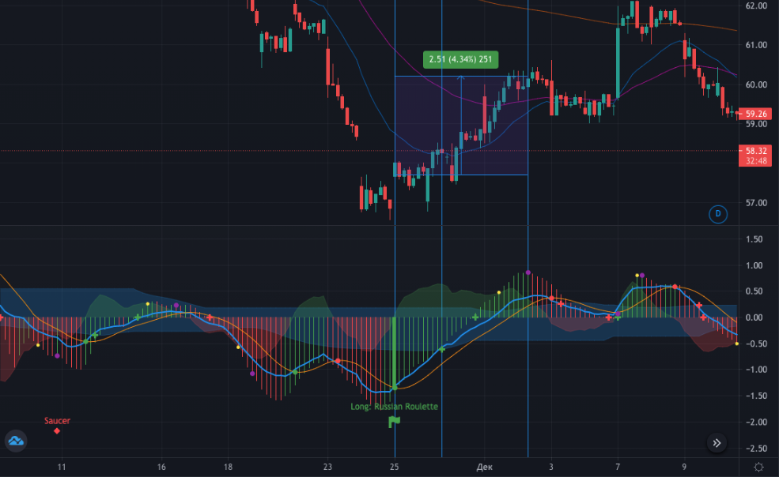

# Awesome Oscillator & MACD Cross Tactic

[Link to the script on TradingView](https://ru.tradingview.com/script/9VAqm1BZ-awesome-oscillator-macd-cross-tactic/)

[DESCRIPTION IN RUSSIAN 🇷🇺](doc/RU-README.md)

Oscillator for Tradingview based on MACD and Awesome Oscillator. This oscillator is designed to identify potential local growth or decline in prices as part of a trend movement.

It shows itself best in stocks, that they move with regular cooldowns, so on the MACD oscillator they are closer to a sinusoid than others. For example MCDONALD'S ($MCD) is quite suitable for this role. On "Tesla's", the oscillator is not very efficient.

> **Warning: the oscillator is provided for educational purposes. Relying on an oscillator alone is very dangerous and unwise. All the actions you perform on your own risk.**

## Entry threshold for understanding the oscillator

To understand what is happening and what this oscillator is based on, you need to the basics:

1. SMA and EMA - what is the difference and how are they calculated.
2. Oscillator MACD.
3. Bill Williams' Awesome Oscillator (AO).

## Components

An oscillator consists of 4 main components:

* AO histogram (red-green bars)
* MACD histogram (presented as a red-green area)
* Intersections of MACD lines - Main and Signal
* Cloud of Rapid Reaction Zone - optional

The AO histogram is plotted according to the classic formula, based on the SMA with periods of 34 and 5. The MACD is plotted on the EMAs of 12, 26 and 9.

**Rapid Reaction Zone** - an optional field that can be enabled in the script settings (Risky Pro mode). This zone is calculated as SMA of AO with a period of 21 and subsequent correction by 50% (these values can be changed). The purpose of the Rapid Reaction Zone is to mark an area where the signal often likes to reverse without breaking through the 0 axis. More details on how to work with it will be described below in the strategies section.

There are also additional symbols presented in the composite chart, which should serve as visual markers:

1. **Green / red dots** - bullish or bearish MACD line crossover
2. **Green / red plus sign** - a potential trend confirmation point and a possible point for entering a position. It is placed at the intersection of the AO zero axis or when the MACD line crosses the Rapid Reaction Zone.
3. **Green / red flag with a highlighted column** - the most risky, but profitable entry point. Russian roulette. It is activated only in risky mode. It is formed only when the MACD lines cross at a level that is at least 75% of the previous AO high / low over the past 50 periods. At the same time, the intersection itself must be 2 times further from the borders of the Rapid Reaction Zone. This signal is best combined with RSI and STOCH. Its goal: to catch the maximum bounce in strong oversold / overbought conditions.
4. **Green / Red Saucer Diamond** - "Tea Saucer" shape on the Awesome Oscillator. It is often worked out within a limited timeframe. For example, a saucer on a 1H chart is better to be within a specific day.
5. **Yellow dot** - potential point of closing a deal with the lowest risk. It is considered as the intersection of the MACD and AO histograms.
6. **Purple dot** - a possible closing point with a slightly higher risk. It is considered as the intersection of the MACD line with the MACD histogram.

The dots only serve as visual markers, not calls to action. Keep this in mind.

## How to use

The main principle is to form confidence in the formation of a local trend. The markers on the graph will help with this. But there are also some points worth paying attention to.

### Wide spread

The AO columns and the MACD histogram should be larger than the reaction zone. In other words, higher volatility. Here is a **correct example** where very strong signals are present due to volatility:

But at such moments it is better not to do anything when the channel becomes narrower:

If a plus sign is formed in a narrow channel without a preceding point (of the same color), it is highly discouraged to enter a trade.

### Focus on MACD

Sometimes you can close a trade without waiting for a MACD reversal signal. For example, when the lines are dangerously close. This confidence can be reinforced with RSI and STOCH.

### Divergences

Since the main structure of the oscillator is based on AO and MACD, nobody canceled their classic divergences. Divergences should also be taken into account when forming your opinion regarding the future price movement.

This chart demonstrates the divergence options for the Awesome Oscillator and their processing along with the main script signals:

Bullish divergence is confirmed by the oscillator signals (green plus signs). Likewise, the bearish divergence, within which the bullish "tea saucer" even manages to work out, just before the price decline.

### MACD angle

When the first plus sign appears to enter a trade, you need to carefully monitor the angle of attack of the blue MACD line. If the line approaches the axis almost parallel, it is better not to enter a trade, since at any moment the situation may turn not in your direction.

### Caution: step down

Sometimes on the oscillator you can find a step formed from the blue MACD line, which lies below 0 degrees on the AO columns. Trade entries should be avoided when a step is formed, as this could signal a reversal against you. To be sure, it is worth checking the situation on lower timeframes.

## Possible strategies

This script provides two main strategies: simple conservative and risky (pro). For a simple strategy, a minimum of information is provided - a signal to confirm a reversal appears closer to the end of the movement itself. Using it, you can enter fast trades for 0.5% -2% profit with a stop at breakeven. The risky strategy is somewhat more complicated. More details about them below.

### Simple conservative

You are looking for the green MACD crosspoint in the negative zone and waiting for confirmation from the AO. When the AO turns in the positive direction (forms a plus sign on the axis), we enter the trade.

The closest point to exit the trade will be highlighted in yellow. The example below illustrates this situation.

To the left of a successful deal, you can draw attention to a failed one. In this case, you should always pay attention to the angle at which the blue MACD line approaches the axis.

### Risky strategy

In order to enable it, you need to open the script settings and check the boxes as in the example below:

The task of a risky strategy is to find as many reversal signals as possible before it is confirmed in order to take a larger profit.

MACD signals are filtered by the Rapid Reaction Zone. The entry point can be the intersection of the MACD line of this zone (plus sign).

An alternative entry point can be a point with a game of Russian roulette, in the hope of catching a good bounce. The figure shows three entry points at once - roulette, risky and conservative. The exit point is purple.

The higher the risk, the greater the profit and the earlier the entry. As well as a potential loss.

In other cases, you must also look for divergences and "saucers" to support your theory.

**What is the main catch of the risk strategy?** And the fact is that for each stock and each timeframe, you should manually select the parameters of the response zone. You should adjust the number of periods at your discretion. The greatest attention should be paid to the size of this zone.

The smaller the response zone, the lower the risk of the transaction. The size of the zone should be selected individually - evaluate on the history of the stock how many unsuccessful transactions could have been avoided with a smaller zone? This point is as subjective as possible, but important. The size of the zone influences, among other things, the calculation of risk entry points of the "roulette" type.

> The material is based solely on the experience of the author. Not an individual investment recommendation.
