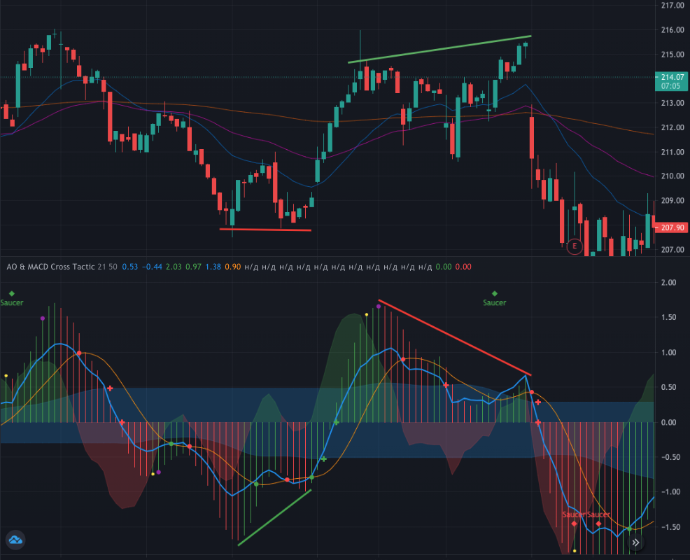

# Awesome Oscillator & MACD Cross Tactic

[Ссылка на осциллятор на TradingView](https://ru.tradingview.com/script/9VAqm1BZ-awesome-oscillator-macd-cross-tactic/)

Осциллятор для Tradingview, базирующийся на MACD и Awesome Oscillator. Данный осциллятор создан для определения потенциального локального роста или уменьшения цены в рамках движения по тренду.

Наиболее хорошо он себя показывает на акциях, что движутся с регулярными проторговками, то есть на осцилляторе MACD они ближе к синусоиде, чем другие. Например MCDONALD'S ($MCD) вполне подходит на эту роль. На Tesla'ах осциллятор не очень эффективен.

> **Предупреждение: осциллятор предоставлен в учебных целях. Полагаться на один лишь осциллятор очень опасно и неразумно. Все свои действия вы осуществляете на свой страх и риск.**

## Порог входа для понимания работы осциллятора

Чтобы понимать что происходит и на чём базируется данный осциллятор необходимо знать их основы:

1. Скользящие SMA и EMA - в чём отличие и как рассчитываются.
2. Осциллятор MACD.
3. "Чудесный Осциллятор Билла Вильямса" - Awesome Oscillator (AO).

## Составные компоненты

Осциллятор состоит из 4 основных компонентов:

* Гистограмма AO (красно-зелёныее столбцы)
* Гистограмма MACD (представлена в виде красно-зелёной зоны)
* Сплетение линий MACD - Основной и Сигнальной
* Облако зоны стремительной реакции (Rapid Reaction Zone) - опциональное

Гистограмма AO строится по классической формуле, базирующийся на SMA с периодами 34 и 5. MACD же строится по EMA 12, 26 и 9.

**Зоны стремительной реакции** - опциональное поле, которое можно включить в настройках скрипта (Risky Pro mode). Данная зона рассчитывается как SMA по AO с периодом в 21 и последующей коррекцией на 50% (данные значения можно изменить). Цель Rapid Reaction Zone обозначить область, в которой сигнал часто любит разворачиваться обратно, не пробивая ось 0. В данной зоне не подсвечиваются пересечения MACD. Подробнее о том, как с ней работать будет описано ниже в разделе стратегий.

Также на составном графике присутствуют дополнительные обозначения, которые должны послужить визуальными маркерами:

1. **Зелёная / красная точки** - бычье или медвежье пересечение линий MACD
2. **Зелёный / красный плюсик** - потенциальная точка подтверждения тренда и возможная точка для входа в позицию. Ставится на пересечении AO нулевой оси или при пересечении линией MACD зоны стрмительной реакции.
3. **Зелёный / красный флажок с выделенным столбцом** - максимально рисковая, но прибыльная точка входа. Русская рулетка. Активируется только в рисковом режиме. Она образуется только в том случае, когда пересечение линий MACD происходит на уровне, который составляет как минимум 75% от предидущего максимума / минимума по AO за прошедшие 50 периодов. При этом, само пересечение должно находится в 2 раза дальше от границ Rapid Reaction Zone. Лучше всего данный сигнал сочетать вместе с RSI и STOCH. Его цель: поймать максимальный отскок в сильной перепроданности / перекупленности.
4. **Зелёный / красный ромб Saucer** - фигура "Чайное блюдце" на Awesome Oscillator. Чаще отрабатывается внутри ограниченного таймфрейма. Например блюдце на 1Ч графике лучше чтобы находилось в рамках конкретного дня.
5. **Жёлтая точка** - потенциальная точка закрытия сделки с наименьшим риском. Считается как пересечение гистограмм MACD и AO.
6. **Фиолетовая точка**- возможная точка закрытия сделки с несколько большим риском. Считается как пересечение линии MACD с гистограммой MACD.

Точки лишь служат визуальными маркерами, а не призывами к действию. Помните об этом.

## Как использовать

Основной принцип - сформировать для себя уверенность в образовании локального тренда. Маркеры на графике помогут с этим. Но есть так же некоторые моменты, на которые стоит обращать внимание.

### Широкий спред

Столбцы AO и гистограмма MACD должны быть больше зоны реакции. Иными словами - более высокая волатильность. Вот **правильный пример**, где благодаря волатильности присутствуют очень сильные сигналы:

А вот в такие моменты лучше ничего не делать, когда канал становится уже:

Если плюсик образуется в узком канале без предшествующей ему точки (того же цвета) - входить в сделку крайне не рекомендуется.

### Внимание на MACD

Иногда можно закрыть сделку не дожидаясь сигнала на разворот по MACD. Например когда линии опасно сближаются. Свою уверенность в этом можно подкрепить с помощью RSI и STOCH.

### Дивергенции

Так как основная база осциллятора строится на AO и MACD, то и их классические дивергенции никто не отменял. Дивергенции также следует учитывать при формировании своего мнения, касательно будущего движения цены.

На этом графике продемонстрированы варианты дивергенций по Awesome Oscillator и их отработка вместе с основными сигналами скрипта:

Бычья дивергенция находит своё подтверждение в сигналах осциллятора (зелёные плюсики). Аналогично и медвежья дивергенция, в рамках которой даже успевает отработаться бычье "чайное блюдце", аккурат перед снижением цены.

### Угол MACD

При появлении первого плюсика для входа в сделку - нужно внимательно следить за углом атаки голубой линии MACD. Если линия подходит к оси практически параллельно - лучше не входить в сделку, так как в любой момент ситуация может развернутся не в вашу сторону.

### Осторожно, ступенька

Иногда на осцилляторе можно встретить ступеньку, образованную из синей линии MACD, которая лежит под 0 градусов на столбцах AO. Следует избегать входов в сделку при образовании ступеньки, так как это может быть сигналом к развороту против вас. Для уверенности стоит проверить ситуацию на младших таймфреймах.

## Возможные стратегии

В данном скрипте предусмотрено две основных стратегии: простая консервативная и рисковая (pro). Для простой стратегии предусмотрено минимум информации - сигнал к подтверждению разворота возникает уже ближе к концу самого движения. По нему можно входить в быстрые сделки ради 0.5%-2% прибыли со стопом в безубыток. Рисковая же стратегия несколько сложнее. Далее про них подробнее.

### Простая консервативная

Вы ищите зелёную точку пересечения MACD в отрицательной зоне и ждёте подтверждения от AO. Когда AO разворачивается в положительном направлении (образует плюсик на оси) - входим в сделку.

Ближайшая точка для выхода из сделки будет отмечена жёлтым цветом. На примере ниже проиллюстрировал данную ситуацию.

Левее успешной сделки можно обратить внимание на провальную сделку. В таком случае всегда следует обращать на угол, под которым голубая линия MACD подходит к оси.

### Рисковая стратегия

Для того, чтобы её включить - необходимо открыть настройки скрипта и проставить галочки как на примере ниже:

Задача рисковой стратегии - найти как можно больше сигналов к развороту до его подтверждения, чтобы забрать больший процент.

Сигналы MACD фильтруются по Зоне Стремительной Реакции. Точкой входа может послужить пересечение линией MACD этой зоны (плюсик).

Альтернативной точкой входа может стать точка с игрой в русскую рулетку, в надежде поймать хороший отскок. На рисунке представлено сразу три точки входа - рулетка, рисковая и консервативная. Точка для выхода - фиолетовая.

Чем выше риск - тем больше прибыль и раньше вход. Как и потенциальный убыток.

В иных случаях необходимо искать также дивергенции и "блюдца" для подкрепления своей теории.

**В чём основной подвох рисковой стратегии?** А в том, что для каждой акции и каждого таймфрейма следует вручную подбирать параметры зоны реагирования. На своё усмотрение следует настраивать количество периодов. Наибольшее внимание следует уделить размеру этой зоны.

Чем меньше зона реагирования - тем меньше риск сделки. Подбирать размер зоны следует индивидуально - оцените на истории акции сколько неудачных сделок удалось бы избежать с меньшей зоной? Этот момент максимально субъективный, но важный. Размер зоны влияет, в том числе, на расчёты рисковых точек входа по типу "рулетки".

> Материал основан исключительно на опыте автора. Не является индивидуальной инвестиционной рекомендацией.
